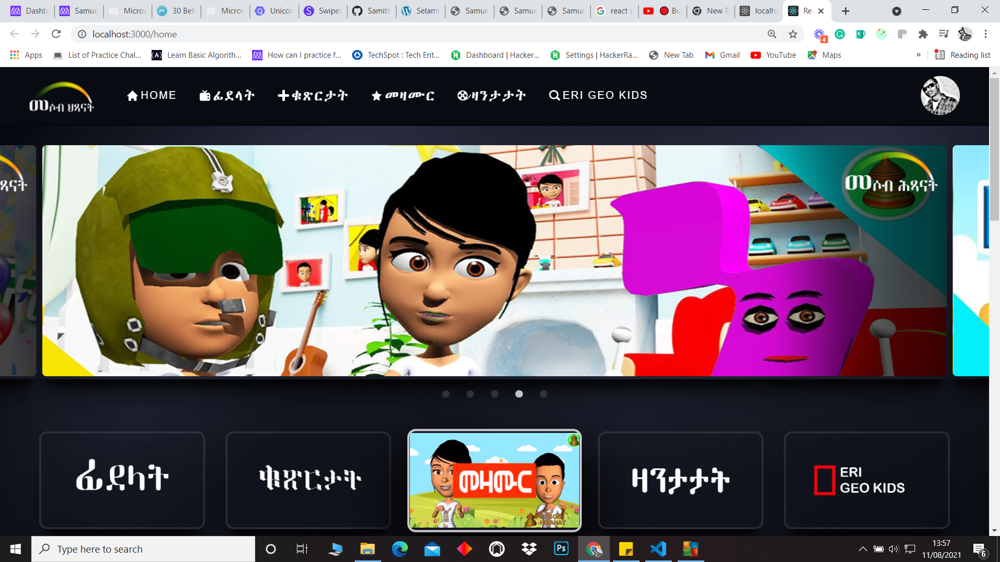

# Mesob Hixanat Project

This project is a website for mesobhixanat youtube channel, which provides a subscription based vides for members.

## Built With
- Node js
- React
- React-Create-App
- React-router-dom
- React-redux
- Redux
- React styled components
- Firebase google authentication
- Rails API
- npm
- ES6
- CSS

[Live Demo Link](https://mesob-hixanat.netlify.app/)

## Getting Started

To get a local copy and running follow these simple example steps.

### Setup

- Node js
- Clone the repo and cd in it.

### Install

- Run `npm install` in your terminal

### Usage

- Run `npm start` in your terminal

Runs the app in the development mode. 
Open [http://localhost:3000](http://localhost:3000) to view it in the browser.

## Author

👤 **Samuel Teweldebrhan Ghebremeskel**

- Github: [@githubhandle](https://github.com/Samitti)
- Twitter: [@twitterhandle](https://twitter.com/Samuel63734232)
- Linkedin: [linkedin](https://www.linkedin.com/in/samuel-ghebremeskel-29685811a/)

## 🤝 Contributing

Contributions, issues and feature requests are welcome!

Feel free to check the [issues page](https://github.com/Samitti/Find-My-Car-Front-End/issues).

## Show your support

Give a ⭐️ if you like this project!
